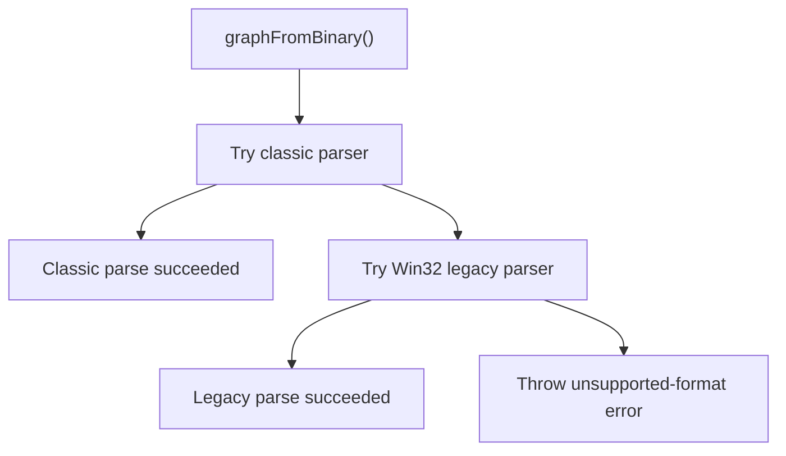
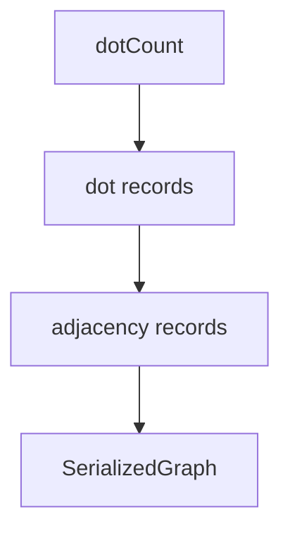
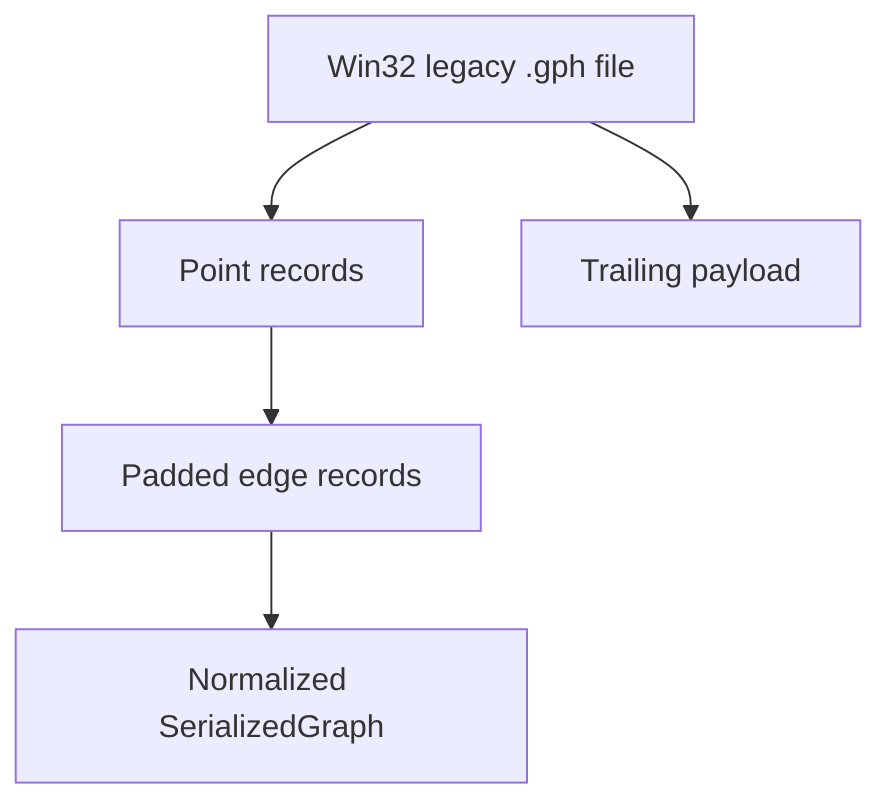
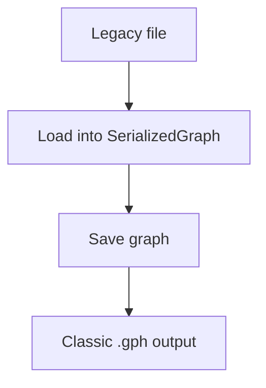

# Binary Graph Format

This document describes the binary `.gph` formats supported by the current codebase.

It covers:

- the format written by the current application
- the classic legacy format from the old C++/MFC editor
- the additional Win32 legacy variant used by the bundled community graphs in `public/graphs`
- the exact compatibility behavior of the current loader

All numeric fields described below are little-endian.

## Overview

The current loader in `src/engine/fileIO/graphFile.ts` supports two binary layouts when reading `.gph` files:

1. `Classic .gph`
2. `Win32 legacy community .gph`

The current writer only emits the classic format.



## Data Model

Both supported readers eventually produce the same in-memory structure:

```ts
type SerializedGraph = {
  dots: Array<{
    x: number
    y: number
    u: number
    v: number
    weight: number
    fixed: boolean
    inputFile: string | null
  }>
  lines: Array<{
    dot1: number
    dot2: number
    k: number
  }>
}
```

Important normalization rules:

- Duplicate undirected edges are collapsed.
- Self-loops are ignored.
- Out-of-range neighbor indices are ignored.
- In the Win32 legacy variant, `u`, `v`, and `inputFile` are not available in a usable form and are reconstructed with defaults.

## Format A: Classic `.gph`

This is the format written by the current application and documented in the older C++ project.

### Status

- Read: supported
- Write: supported
- Source of truth:
  - `src/engine/fileIO/graphFile.ts`
  - legacy C++ `graphToFile()` / `graphFromFile()`

### File Layout

```text
int32 dotCount

repeat dotCount times:
  int32   x
  int32   y
  float64 weight
  float64 v
  float64 u
  int32   fixed
  int32   filenameLength
  byte[]  filenameBytesIncludingTrailingNul

repeat dotCount times:
  int32 edgeCount
  repeat edgeCount times:
    int32   neighborIndex
    float64 stiffness
```

### Dot Record

| Field | Type | Meaning |
|---|---|---|
| `x` | `int32` | Canvas X coordinate |
| `y` | `int32` | Canvas Y coordinate |
| `weight` | `float64` | Node mass |
| `v` | `float64` | Initial velocity |
| `u` | `float64` | Initial displacement |
| `fixed` | `int32` | `0` or non-zero |
| `filenameLength` | `int32` | Length in bytes, including trailing `\0` |
| `filenameBytesIncludingTrailingNul` | raw bytes | Optional WAV path |

### Edge Record

| Field | Type | Meaning |
|---|---|---|
| `neighborIndex` | `int32` | Adjacent dot index |
| `stiffness` | `float64` | Edge stiffness |

### Notes

- The file stores adjacency per dot, not a deduplicated edge list.
- When loading, the reader reconstructs unique undirected edges with an internal `seen` set.
- Empty filenames are normalized to `null`.
- The current application writes this format when the user clicks `Save graph`.



## Format B: Win32 Legacy Community `.gph`

This is the format used by the bundled files in `public/graphs`.

It is not the same layout as the classic C++ `graphFromFile()` format, even though the file extension is still `.gph`.

### Status

- Read: supported
- Write: not supported
- Source of truth:
  - inferred from real files in `public/graphs`
  - implemented in `graphFromWin32LegacyBinary()`

### Why This Exists

The community `.gph` files do not match the classic per-field C++ serializer.

Evidence:

- They fail the classic TypeScript parser immediately.
- They also fail a standalone C++ reader built directly from `My_template_old/2dtofile.cpp`.
- Their byte pattern is consistent across many files and strongly suggests a second 32-bit Windows layout with struct padding in edge records.

### Reconstructed Point Record

The current loader interprets each point as:

```text
int32   dotCount

repeat dotCount times:
  uint8   fixed
  float64 weight
  float64 legacyA
  float64 legacyB
  float64 xScaled
  float64 yScaled
  float64 legacyExtra
  int32   edgeCount
  repeat edgeCount times:
    int32   neighborIndex
    int32   sourceIndexOrPadding
    float64 stiffness
```

### Interpreted Fields

| Field | Type | Current interpretation |
|---|---|---|
| `fixed` | `uint8` | `0` or non-zero |
| `weight` | `float64` | Used directly |
| `legacyA` | `float64` | Present in file, not mapped |
| `legacyB` | `float64` | Present in file, not mapped |
| `xScaled` | `float64` | Interpreted as `x / 100` in file |
| `yScaled` | `float64` | Interpreted as `y / 100` in file |
| `legacyExtra` | `float64` | Present in file, not mapped |
| `edgeCount` | `int32` | Used directly |

### Edge Record

| Field | Type | Current interpretation |
|---|---|---|
| `neighborIndex` | `int32` | Adjacent dot index |
| `sourceIndexOrPadding` | `int32` | Ignored by the loader |
| `stiffness` | `float64` | Used directly |

### Coordinate Conversion

The file stores positions in a scaled floating-point form.

The current loader reconstructs canvas coordinates like this:

```ts
x = xScaled * 100
y = yScaled * 100
```

This matches the bundled community graphs well enough for rendering and interaction.

### Values Not Preserved

This format does not currently provide a safe mapping for some `SerializedGraph` fields.

The loader therefore reconstructs them as:

| Output field | Value used |
|---|---|
| `u` | `START_U` |
| `v` | `START_V` |
| `inputFile` | `null` |

### Extra Data

Many files in `public/graphs` contain additional trailing bytes after the graph structure has been read.

Current behavior:

- the graph portion is parsed successfully
- the remaining bytes are ignored by the loader

This trailing data is likely part of the original Windows-era export pipeline, but it is not currently decoded because it is not required to render and simulate the graph topology.



## Loader Behavior

The current loader uses this decision process:

### Step 1: Try classic format

The classic parser expects:

- `int32 x`
- `int32 y`
- `float64 weight`
- `float64 v`
- `float64 u`
- `int32 fixed`
- `int32 filenameLength`

If any required length or offset becomes invalid, the parser fails.

### Step 2: Try Win32 legacy format

The fallback parser expects:

- `uint8 fixed`
- six `float64` values
- `int32 edgeCount`
- padded 16-byte edge records

If this succeeds, the result is converted to `SerializedGraph`.

## Write Behavior

The writer always emits the classic format.

That means:

- saving a newly created graph produces a classic `.gph`
- loading a Win32 legacy file and saving it again will convert it to the classic layout

This is intentional. The current app has one canonical write format and multiple read-compatible legacy formats.



## Compatibility Summary

| Capability | Classic `.gph` | Win32 legacy community `.gph` |
|---|---|---|
| Read | Yes | Yes |
| Write | Yes | No |
| Preserves `x` / `y` | Yes | Yes, via scale conversion |
| Preserves `weight` | Yes | Yes |
| Preserves `fixed` | Yes | Yes |
| Preserves `u` / `v` | Yes | No |
| Preserves `inputFile` | Yes | No |
| Preserves stiffness | Yes | Yes |
| Supports bundled `public/graphs` | No | Yes |

## Practical Notes

- If you need exact byte-for-byte compatibility with old editor saves, use the classic format.
- If you need to open bundled community graphs, the loader will use the Win32 legacy fallback automatically.
- If you load a community graph and save it again, the result will be normalized into the classic format.

## Reference Files

- Current implementation: `src/engine/fileIO/graphFile.ts`
- Unit coverage: `src/engine/fileIO/graphFile.test.ts`
- UI loading coverage: `e2e/menu.spec.ts`
- Legacy C++ reader experiment: `tests/legacy_serializer_cpp/legacy_serializer_cpp.cpp`
- Old classic format description: `../SoundSynthesis/README.md`
